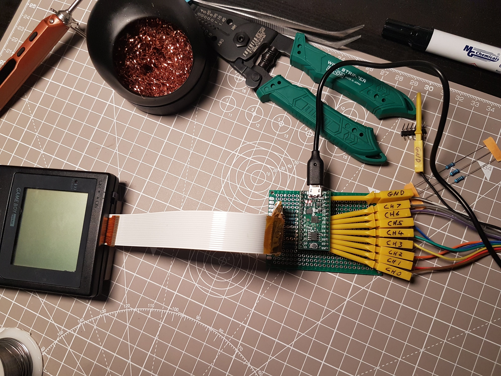
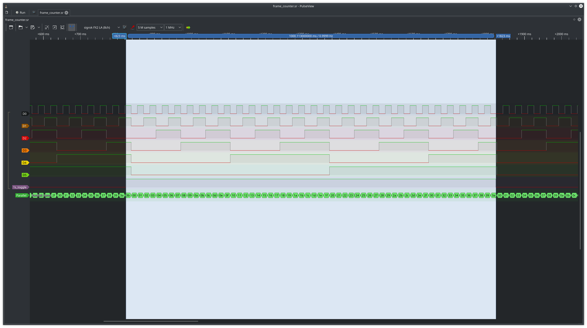
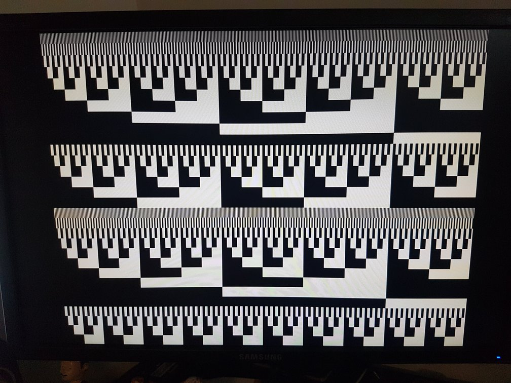
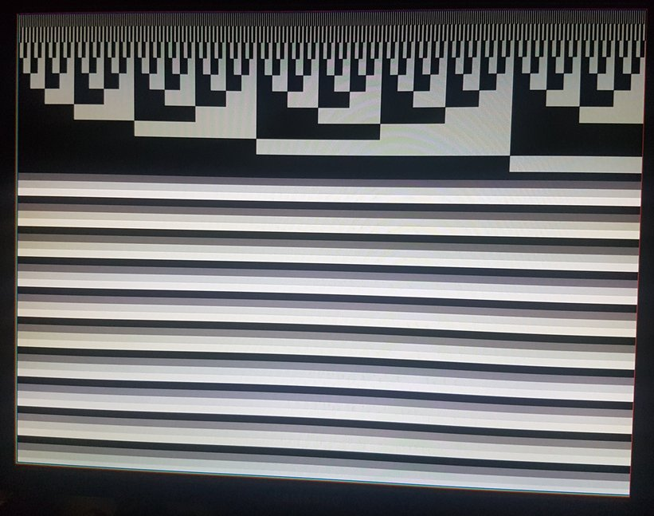
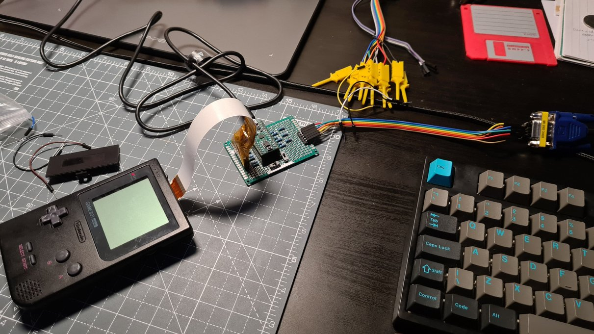
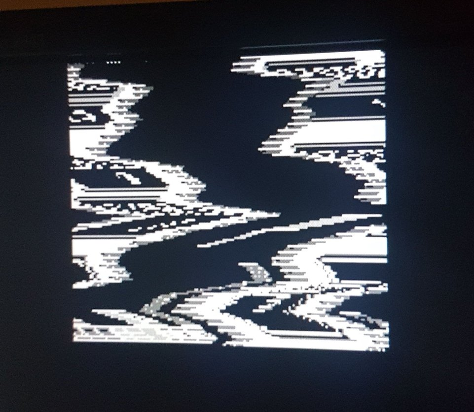
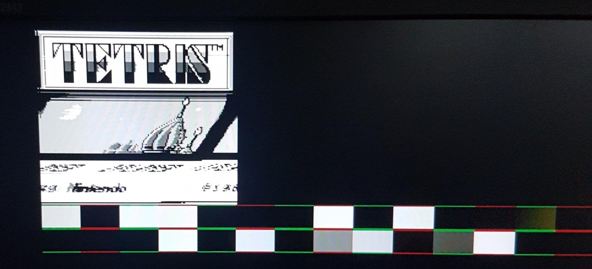
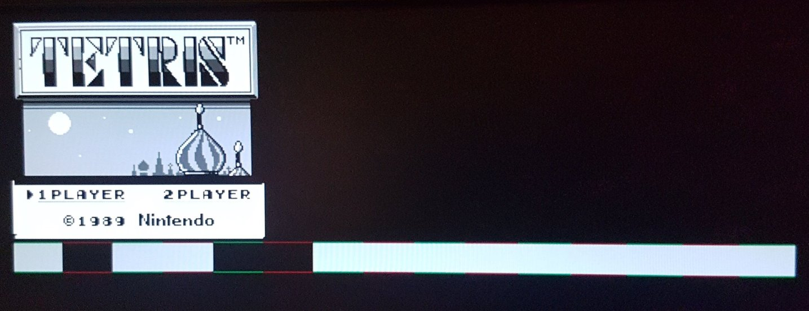
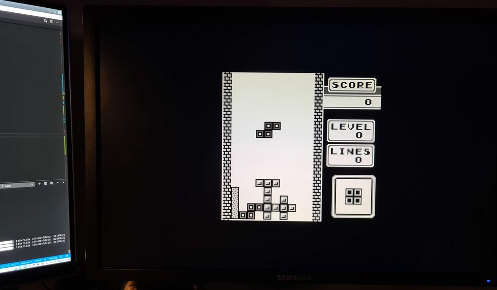

# FPGA Game Boy Framebuffer

My attempts at hooking in to the Game Boy LCD cable to sniff frame data.

Currently only looking at the Game Boy Pocket as I have one with screen rot and would ideally like to add other output options or replace the screen with something else.

## Requirements

Currently running off an [Lattice Semi](http://www.latticesemi.com) FPGA on a [TinyFPGA BX](https://github.com/tinyfpga/TinyFPGA-BX).

After cloning this repository make sure to pull in the submodule for building/flashing the RTL

```bash
git submodule update --init
```

This should pull in my forked version of the excellent [fpga-tools](https://github.com/pwmarcz/fpga-tools/) submodule by [Paweł Marczewski](https://github.com/pwmarcz).

Required software:

- [Project IceStorm](http:///www.clifford.at/icestorm/)
- [iceBurn](https://github.com/davidcarne/iceBurn)
- GTKWave (for `make sim` target)

## RTL

Experiments documented in [see the rtl/exploration/Readme.md](./rtl/exploration/Readme.md).

Actual code is in the RTL folder currently.

## Devlog

Gameboy MGB (pocket) LCD cable pinout:

	1 - GND
	2 - Control
	3 - Data latch
	4 - Horiz Sync
	5 - Data 0
	6 - Data 1
	7 - Clock
	8 - Alt Sig
	9 - V5
	10 - V3
	11 - V2
	12 - Data latch
	13 - VSYNC
	14 - Vcc (5 volts)
	15 - Alt sign
	16 - V1
	17 - V4
	18 - V5

I connected that to the FPGA and passed the signals through to check the voltages were all okay and the FPGA was registering the signals as expected.



Trace from [frame_counter.v](rtl/exploration/frame_counter.v) showing `0x3B` transitions of the `VSYNC` signal per second, aka 59fps:



Trace from [pixels_per_frame_counter.v](rtl/exploration/pixels_per_frame_counter.v) showing `0x59FF` pixel clock transitions per `VSYNC`:











