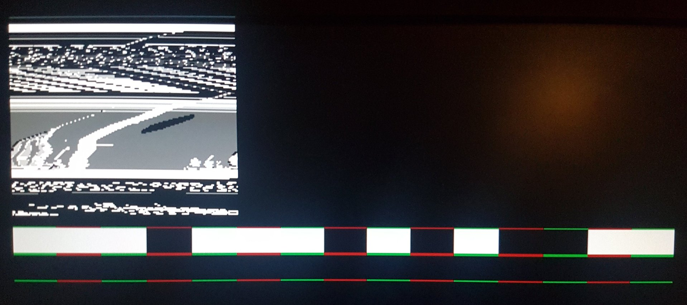

# FPGA Game Boy Framebuffer

My attempts at hooking in to the Game Boy LCD cable to sniff frame data.

Currently only looking at the Game Boy Pocket as I have one with screen rot and would ideally like to add other output options or replace the screen with something else.

## Requirements

Currently running off an [Lattice Semi](http://www.latticesemi.com) FPGA on a [TinyFPGA BX](https://github.com/tinyfpga/TinyFPGA-BX).

After cloning this repository make sure to pull in the submodule for building/flashing the RTL

```bash
git submodule update --init
```

This should pull in my forked version of the excellent [fpga-tools](https://github.com/pwmarcz/fpga-tools/) submodule by [Paweł Marczewski](https://github.com/pwmarcz).

Required software:

- [Project IceStorm](http:///www.clifford.at/icestorm/)
- [iceBurn](https://github.com/davidcarne/iceBurn)
- GTKWave (for `make sim` target)

## RTL

Experiments documented in [see the rtl/exploration/Readme.md](./rtl/exploration/Readme.md).

Actual code is in the RTL folder currently.

## Devlog

Gameboy MGB (pocket) LCD cable pinout:

	1 - GND
	2 - Control
	3 - Data latch
	4 - Horiz Sync
	5 - Data 0
	6 - Data 1
	7 - Clock
	8 - Alt Sig
	9 - V5
	10 - V3
	11 - V2
	12 - Data latch
	13 - VSYNC
	14 - Vcc (5 volts)
	15 - Alt sign
	16 - V1
	17 - V4
	18 - V5

I connected that to the FPGA and passed the signals through to check the voltages were all okay and the FPGA was registering the signals as expected.


Trace from [frame_counter.v](rtl/exploration/frame_counter.v) showing `0x3B` transitions of the `VSYNC` signal per second, aka 59fps:


Trace from [pixels_per_frame_counter.v](rtl/exploration/pixels_per_frame_counter.v) showing `0x59FF` pixel clock transitions per `VSYNC`:


VGA core started with some timing bars to check my timings and pixel counts added up.


That worked so I moved on to a 2 bit grayscale colour system using resistor values to tweak voltage levels for VGA.


By this time my desk is a mess.


Protoboard was soldered together for a cleaner setup after breadboarding.


First attempts at capturing and displaying the framebuffer from the GameBoy LCD showed some severe timing issues.


It also showed the colour palette was inverted.



Fixing the palette was simple, but finding thr source of the HSYNC skew was tougher.


Eventually traced my HSYNC issues down to a badly terminated HSYNC connection from the LCD. Still the game looked a little slanted, especially at the lower part of the screen.


That was down to me incorrectly counting pixels and underfilling lines. With this fixed it's almost passable.


With everything working I could remove my debug information and add a 2x scaling to the display, and centre it to the screen.


:tada:
