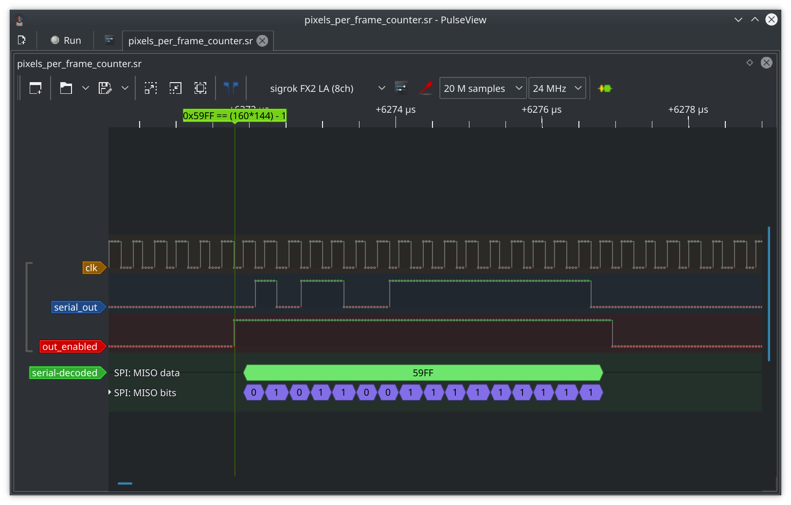

# Exploratory RTL

While developing this I sometimes needed to try things out. This folder contains my files.

## blink.v

While doing some dumps of the LCD cable previously I noticed issues with the VSYNC signal. To investigate this further I wanted to get an FPS counter from the cable based on vsync signals seen per second.

I developed on an iCEblink40LP1K devkit which has a 3.33MHz clock by default, to get the "per second" figure to a reasonable degree of accuracy I wrote blink.v to toggle an LED every second.

I used a logic analyser to check how accurate the timing was and tweaked the CLOCKS_PER_SEC parameter to hone in on a 1 second LED_STATE toggle.

### Building

```bash
make flash-blink
```

## frame_counter.v

Counts VSYNC signal per second, outputting counter on pins [B26, B27, A38, B29, B30, B31, A43, B34] and the second toggle on LED4/pin A25


In the above screenshot I could confirm I was seeing 0x3B (59) frames per second.

### Building

```bash
make flash-frame_counter
```

## pixels_per_frame_counter.v

Counts PIXEL_CLOCK falling per VSYNC, outputting counter in serial form at the fpga clock rate.



In the above screenshot I could confirm I was seeing 0x59FF (23039 == (160*144) - 1) the expected number of pixels

### Building

```bash
make flash-pixels_per_frame_counter
```

## vga_test.v

Testing VGA

### Building

```bash
make flash-vga_test
```

## uart.v

Testing UART

### Building

```bash
make flash-uart
```

## vga_test.v

Testing VGA with a gb screen sized framebuffer and optional 2x scaling

### Building

```bash
make flash-vga_frame_buffer_test
```
